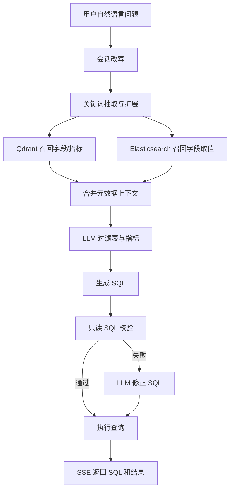

# DataAgent Java AI

## 项目简介

DataAgent Java AI 是一个面向数据库的智能数据查询 Agent，用户可以用自然语言提出业务分析问题，系统自动完成问题理解、元数据召回、SQL 生成、SQL 安全校验、查询执行与结果展示，降低业务人员使用数据分析系统的门槛。

## 方向

方向一：Agentic AI 原生开发。

项目类型：垂直领域 Agent，具体定位为面向企业数据仓库的数据查询 Agent。

本项目从零构建一个智能数据查询 Agent。传统数据分析通常依赖固定报表、人工编写 SQL 或 BI 拖拽配置，业务人员在提出临时分析问题时需要理解数据表结构、指标口径和 SQL 语法。本系统通过 Agentic AI 将自然语言问题转化为可执行的只读 SQL，并以流式进度、SQL 与表格结果返回给用户，使 Agent 承担“业务问题理解 + 数据上下文检索 + 查询生成 + 安全校验 + 结果交付”的数据分析师角色。

## 传统方式与 Agent 方式对比

| 对比项 | 传统数据分析方式 | DataAgent 工作方式 |
| --- | --- | --- |
| 查询方式 | 人工编写 SQL 或依赖固定报表 | 自然语言提问，Agent 自动生成 SQL |
| 数据理解 | 用户需要熟悉表、字段、指标口径 | 系统从元数据库、向量库和检索库召回相关信息 |
| 执行反馈 | 用户只能等待最终结果 | SSE 流式返回问题改写、召回、生成、校验、执行等步骤 |
| 安全控制 | SQL 质量与安全依赖人工检查 | 内置只读 SQL 校验，禁止非查询语句和多语句执行 |
| 多轮体验 | 上下文需要用户重复描述 | 保留最近会话轮次，用于后续问题改写 |

## 技术栈

- AI IDE: IDEA+CODEX
- LLM: 通义千问 DashScope OpenAI 兼容接口
- Agent 框架/能力: Spring AI、Prompt Templates、Function Calling 风格工具编排
- 后端: Java 21、Spring Boot 4、Spring Web MVC、JDBC
- 前端: Vue 3、Vite、Fetch + SSE
- 数据库: MySQL，包括 `meta` 元数据库与 `dw` 数据仓库
- 检索基础设施: Qdrant 向量检索、Elasticsearch 取值检索
- 工程工具: Maven、npm、Git

## 核心能力

1. 自然语言数据查询：将业务问题转为数据仓库 SQL。
2. 会话记忆：按 `sessionId` 保存最近 10 轮上下文，支持追问改写。
3. 元数据召回：基于 Qdrant 召回字段与指标，基于 Elasticsearch 召回字段取值。
4. Agent 多步骤推理：关键词抽取、字段召回、取值召回、指标召回、表过滤、指标过滤、SQL 生成、SQL 校验、SQL 修正、SQL 执行。
5. SQL 安全防护：只允许 `SELECT` / `WITH` 查询，阻断写入、DDL、授权、导出等高风险关键字。
6. 流式交互：后端通过 SSE 推送进度，前端实时展示步骤、SQL 与查询结果表格。

## Agent 工作流



## 目录结构

```text
.
|-- backend/                         # Spring Boot 后端服务
|   |-- .env.example                 # 环境变量示例，不包含真实密钥
|   |-- pom.xml                      # Maven 配置
|   `-- src/
|       |-- main/
|       |   |-- java/com/fgwh/
|       |   |   |-- config/          # 数据源、配置属性、Jackson 配置
|       |   |   |-- controller/      # HTTP API 与 SSE 接口
|       |   |   |-- model/           # Agent 状态与领域模型
|       |   |   |-- repository/      # MySQL、Qdrant、Elasticsearch 访问层
|       |   |   |-- scripts/         # 元数据知识库构建与清理脚本
|       |   |   |-- service/         # Agent 主流程、LLM 调用、会话记忆
|       |   |   `-- util/            # JSON 与 SQL 安全工具
|       |   `-- resources/
|       |       |-- application.yml  # 服务、模型、数据库与检索配置
|       |       |-- meta_config.yaml # 示例数仓元数据与指标配置
|       |       `-- prompts/         # SQL 生成、召回过滤、改写等提示词
|       `-- test/java/com/fgwh/      # 后端单元测试
|-- frontend/                        # Vue 3 前端
|   |-- public/                      # 静态资源
|   |-- index.html                   # Vite HTML 入口
|   |-- package.json                 # npm 脚本与依赖
|   |-- package-lock.json            # npm 依赖锁定文件
|   |-- vite.config.js               # Vite 端口与 /api 代理配置
|   `-- src/
|       |-- App.vue                  # 对话式数据查询页面
|       |-- main.js                  # 前端入口
|       |-- style.css                # 全局样式
|       |-- assets/                  # 前端图片等资源
|       `-- components/              # Vue 组件
|-- docs/                            # 项目报告、演示视频与数据库脚本
|   |-- 数据库/
|   |   |-- dw.sql                   # 示例数据仓库脚本
|   |   `-- meta.sql                 # 元数据库脚本
|   |-- CS599_大作业报告.pdf         # 项目报告
|   `-- 录屏展示.mp4                 # 演示视频
|-- logs/                            # 运行日志目录
|-- LICENSE                          # MIT 开源许可证
`-- README.md                        # 项目说明文档
```

## 环境搭建

### 1. 前置依赖

- JDK 21
- Maven 3.9+
- Node.js 20+ 与 npm
- MySQL 8+
- Qdrant
- Elasticsearch
- DashScope API Key

### 2. 环境变量配置

复制后端环境变量模板：

```bash
cp backend/.env.example backend/.env
```

PowerShell 可使用：

```powershell
Copy-Item backend\.env.example backend\.env
```

在 `backend/.env` 中填写本地配置。注意：不得将真实 API Key、数据库密码或服务器地址提交到 GitHub。

关键变量包括：

```env
DASHSCOPE_API_KEY=sk-XXX
DASHSCOPE_BASE_URL=https://dashscope.aliyuncs.com/compatible-mode/v1
QWEN_MODEL=qwen-plus
DASHSCOPE_EMBEDDING_MODEL=text-embedding-v4
EMBEDDING_DIMENSIONS=1024

MYSQL_HOST=127.0.0.1
MYSQL_PORT=3306
MYSQL_USER=root
MYSQL_PASSWORD=your-password

REMOTE_LINUX_HOST=127.0.0.1
QDRANT_PORT=6333
ES_PORT=9200
```

### 3. 初始化数据

1. 在 MySQL 中准备 `meta` 和 `dw` 两个数据库。
2. 在 `dw` 数据库中准备业务数据表，例如 `dim_region`、`dim_customer`、`dim_product`、`dim_date`、`fact_order`。
3. 根据实际表结构调整 `backend/src/main/resources/meta_config.yaml`。
4. 运行 `com.fgwh.scripts.BuildMetaKnowledge` 构建元数据知识库，将表字段、指标、字段取值同步到 MySQL、Qdrant 与 Elasticsearch。

### 4. 启动后端

建议在仓库根目录执行，保证 `backend/.env` 能被正确加载：

```bash
mvn -f backend/pom.xml spring-boot:run
```

后端默认启动在：

```text
http://127.0.0.1:8001
```

主要接口：

- `POST /api/query`: 提交自然语言查询，返回 `text/event-stream`
- `DELETE /api/conversations/{sessionId}`: 清空指定会话记忆

### 5. 启动前端

```bash
cd frontend
npm install
npm run dev
```

前端默认启动在：

```text
http://127.0.0.1:5174
```

Vite 已将 `/api` 代理到 `http://127.0.0.1:8001`。

## 测试与验证

当前项目可按以下方式验证：

1. 后端启动后，确认 `/api/query` 可以返回 SSE 事件。
2. 在前端输入电商数据分析问题，例如“统计各省 GMV 排名前 10 的地区”。
3. 观察页面是否依次展示执行步骤、生成 SQL 与查询结果。
4. 检查日志文件 `backend/logs/` 或根目录 `logs/`，定位模型调用、数据库连接或检索服务问题。
5. 尝试构造包含写入、删除、建表等意图的问题，确认 `SqlGuard` 能阻断非只读 SQL。

## 项目状态

- [x] Proposal: 选题为垂直领域数据分析师 Agent
- [x] MVP: 完成自然语言查询、元数据召回、SQL 生成、SQL 校验、SSE 返回与前端展示
- [ ] Final: 完善测试报告、Demo 截图/录屏、部署说明与课程总结


## 参考与引用

本项目实现参考或使用了以下技术与开源生态：

- Spring Boot / Spring AI
- Vue 3 / Vite
- MySQL
- Qdrant
- Elasticsearch
- DashScope OpenAI 兼容接口
